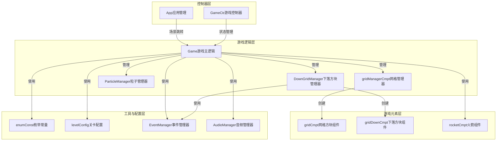

# 水果消除游戏技术文档

## 1. 仓库概览

这是一个基于Cocos Creator 3.x引擎开发的水果消除类游戏，采用经典的三消玩法，融合了下落方块系统和血量机制，增加了游戏的挑战性和趣味性。

### 主要功能/亮点：
- 经典三消玩法：通过滑动交换相邻水果方块，消除三个或更多连成一线的相同水果
- 下落方块系统：屏幕上方会持续生成下落的水果方块，增加游戏挑战性
- 血量机制：下落方块到达底部会扣除玩家血量，血量为0时游戏失败
- 炸弹系统：包含横向火箭、纵向火箭、爆炸炸弹和特殊炸弹四种类型
- 道具系统：玩家可以使用各种道具来辅助游戏
- 多关卡配置：支持通过JSON配置文件定义不同关卡的目标和难度
- 流畅的动画效果：包含方块交换、消除、下落等多种动画效果
- 粒子特效：方块消除和炸弹爆炸时的粒子特效
- 音频系统：游戏音效和背景音乐

### 典型应用场景：
- 休闲娱乐：适合玩家在碎片化时间进行游戏
- 关卡挑战：通过不断挑战更高难度的关卡获得成就感
- 道具收集：收集和使用各种道具来增强游戏体验

## 2. 目录结构

本项目采用模块化的目录结构，将游戏逻辑、资源和工具类分离，便于维护和扩展。主要代码位于`assets/Script`目录下，按照功能模块进行组织。游戏核心逻辑位于`game`子目录，包含游戏主逻辑、游戏元素组件和游戏管理器。控制器类位于`Controller`目录，负责游戏状态管理和场景跳转。工具类和配置文件位于`Tools`目录，提供各种辅助功能和常量定义。

```text
├── assets/                           # 项目资源目录
│   ├── Script/                       # 脚本代码目录
│   │   ├── Common/                   # 通用组件和工具
│   │   │   ├── AudioManager.ts       # 音频管理器
│   │   │   ├── GameData.ts           # 游戏数据管理
│   │   │   ├── Http.ts               # HTTP请求工具
│   │   │   ├── PathMovement.ts       # 路径移动工具
│   │   │   ├── StateMachine.ts       # 状态机
│   │   │   ├── TextUti.ts            # 文本工具
│   │   │   ├── TouchCmpt.ts          # 触摸组件
│   │   │   ├── UrlConfig.ts          # URL配置
│   │   │   └── view/                 # 视图相关
│   │   ├── Controller/               # 控制器类
│   │   │   ├── GameCtr.ts            # 游戏控制器
│   │   │   ├── app.ts                # 应用管理
│   │   │   └── singletonClass.ts     # 单例类基类
│   │   ├── Tools/                    # 工具类和配置
│   │   │   ├── cocosHelper.ts        # Cocos辅助工具
│   │   │   ├── enumConst.ts          # 枚举常量定义
│   │   │   ├── eventName.ts          # 事件名称定义
│   │   │   ├── levelConfig.ts        # 关卡配置
│   │   │   └── toolsHelper.ts        # 工具辅助类
│   │   ├── channel/                  # 渠道相关
│   │   ├── game/                     # 游戏核心逻辑
│   │   │   ├── item/                 # 游戏元素组件
│   │   │   │   ├── blockCmpt.ts      # 方块组件
│   │   │   │   ├── gridCmpt.ts       # 网格方块组件
│   │   │   │   ├── gridDownCmpt.ts   # 下落方块组件
│   │   │   │   └── rocketCmpt.ts     # 火箭组件
│   │   │   ├── Manager/              # 游戏管理器
│   │   │   │   ├── DownGridManager.ts # 下落方块管理器
│   │   │   │   ├── gridManagerCmpt.ts # 网格管理器
│   │   │   │   ├── ParticleManager.ts # 粒子管理器
│   │   │   │   └── Turret.ts         # 炮塔管理器
│   │   │   ├── BaseNode.ts           # 基础节点类
│   │   │   ├── Game.ts               # 游戏主逻辑
│   │   │   └── Start.ts              # 开始场景
│   │   └── sysloader/                # 资源加载器
│   ├── Texture/                      # 纹理资源
│   └── resources/                    # 资源文件
│       ├── anim/                     # 动画资源
│       ├── audio/                    # 音频资源
│       ├── font/                     # 字体资源
│       └── json/config/              # 关卡配置文件
├── .gitattributes                    # Git属性配置
└── .gitignore                        # Git忽略文件
```

### 核心文件说明：

| 文件路径 | 模块名称 | 主要职责 | 文件大小 | 重要性 |
|---------|---------|---------|---------|-------|
| `assets/Script/game/Game.ts` | 游戏主逻辑 | 处理游戏核心机制，包括方块消除、水果下落、游戏状态管理等 | 1925行 | ★★★★★ |
| `assets/Script/game/item/gridCmpt.ts` | 方块组件 | 管理单个水果方块的状态和行为 | 139行 | ★★★★★ |
| `assets/Script/game/item/gridDownCmpt.ts` | 下落方块组件 | 管理从上方下落的水果方块 | 220行 | ★★★★☆ |
| `assets/Script/game/Manager/DownGridManager.ts` | 下落方块管理器 | 管理下落方块的生成、回收和下落逻辑 | 693行 | ★★★★☆ |
| `assets/Script/Controller/GameCtr.ts` | 游戏控制器 | 管理游戏状态、道具和关卡数据 | 405行 | ★★★★☆ |
| `assets/Script/Controller/app.ts` | 应用管理 | 负责场景跳转和游戏初始化 | 75行 | ★★★☆☆ |
| `assets/Script/Tools/enumConst.ts` | 枚举常量 | 定义游戏中使用的枚举和常量 | 134行 | ★★★☆☆ |
| `assets/Script/Tools/levelConfig.ts` | 关卡配置 | 加载和管理关卡数据 | 100+行 | ★★★☆☆ |

## 3. 系统架构与主流程

### 系统架构

本项目采用模块化的架构设计，基于Cocos Creator的节点和组件系统，将游戏逻辑分解为多个独立的模块，通过事件系统实现模块间的通信。



### 主要流程

#### 1. 游戏启动流程

1. **场景加载**：通过`App.GoGame()`方法加载游戏场景
2. **资源初始化**：`Game.onLoad()`方法初始化UI引用、绑定事件、加载游戏数据
3. **网格初始化**：`Game.initLayout()`方法初始化游戏网格和方块
4. **下落系统启动**：`Game.startDownGrid()`方法启动上方水果方块下落系统
5. **游戏开始**：进入游戏主循环，等待玩家输入

#### 2. 游戏主循环流程

1. **触摸检测**：检测玩家的触摸和滑动操作
2. **方块交换**：处理相邻方块的交换逻辑
3. **消除检测**：检测并消除满足条件的方块组合
4. **方块下落**：处理消除后上方方块的下落
5. **新方块生成**：在顶部生成新的方块
6. **目标检查**：检查是否达成关卡目标
7. **血量检查**：检查是否血量为0，游戏失败
8. **下落方块检查**：检查下落方块是否到达底部，扣除血量

#### 3. 方块消除流程

1. **检测消除**：通过`Game.startCheckThree()`方法检查网格中是否有可消除的方块组合
2. **播放特效**：播放消除特效和音效
3. **更新目标**：更新关卡目标消除数量
4. **方块下落**：上方方块下落填补空缺
5. **新方块生成**：在顶部生成新的方块
6. **连锁检查**：检查是否触发新的消除

#### 4. 下落方块流程

1. **生成方块**：`DownGridManager.generateSingleGrid()`方法从上方生成水果方块
2. **方块下落**：方块从屏幕上方下落
3. **碰撞检测**：检测下落方块是否到达底部
4. **扣血处理**：下落方块到达底部时扣除玩家血量
5. **方块回收**：下落方块被攻击到血量为0时被回收

## 4. 核心功能模块

### 4.1 方块管理模块

#### 4.1.1 网格方块组件 (`gridCmpt`)

**功能说明**：管理单个水果方块的状态和行为，包括类型、位置、攻击值等属性。

**核心属性**：
- `h, v`：方块在网格中的坐标
- `type`：方块类型（水果种类）
- `attack`：方块的攻击力
- `data`：方块的位置数据

**核心方法**：
- `initData(h, v, type)`：初始化方块数据
- `setType(type)`：设置方块类型
- `isInside(pos)`：检查位置是否在方块内
- `setSelected(bool)`：设置方块选中状态

**使用场景**：
- 游戏初始化时创建网格方块
- 玩家触摸和滑动时的方块交互
- 方块消除和下落时的状态更新

**代码位置**：`assets/Script/game/item/gridCmpt.ts`

#### 4.1.2 下落方块组件 (`gridDownCmpt`)

**功能说明**：管理从上方下落的水果方块，包括类型、血量等属性。

**核心属性**：
- `type`：方块类型（水果种类）
- `health`：方块血量
- `virtualHealth`：方块虚拟血量

**核心方法**：
- `initData(type)`：初始化方块数据
- `takeDamage(damage, callback)`：处理方块受伤
- `addHealth(amount)`：增加方块血量
- `setHealthByLevel(level)`：根据等级设置血量

**使用场景**：
- 上方生成下落的水果方块
- 下方网格方块消除时向上方发射子弹攻击下落方块
- 下落方块到达底部时扣除玩家血量

**代码位置**：`assets/Script/game/item/gridDownCmpt.ts`

#### 4.1.3 下落方块管理器 (`DownGridManager`)

**功能说明**：管理下落方块的生成、回收和下落逻辑，优化性能。

**核心属性**：
- `gridDownPre`：水果方块预制体
- `totalGridCount`：总方块数量
- `fallSpeed`：下落速度
- `activeGrids`：活跃水果方块数组
- `gridPool`：水果方块对象池

**核心方法**：
- `createGrid()`：创建下落方块
- `startGenerate()`：开始生成下落方块
- `pauseFall()`：暂停下落
- `resumeFall()`：恢复下落
- `recycleGrid(gridNode)`：回收水果方块到对象池
- `eliminateFrontRows(rows)`：消除最前面的几排水果方块

**使用场景**：
- 游戏开始时启动下落方块系统
- 游戏暂停/继续时控制下落方块状态
- 下落方块到达底部时消除并扣血
- 优化性能，复用水果方块对象

**代码位置**：`assets/Script/game/Manager/DownGridManager.ts`

### 4.2 游戏逻辑模块

#### 4.2.1 游戏主逻辑 (`Game`)

**功能说明**：处理游戏核心逻辑，包括方块消除、下落和游戏状态管理。

**核心属性**：
- `blockArr`：游戏网格方块数组
- `blockPosArr`：方块位置数组
- `gameState`：游戏状态
- `playerHealth`：玩家血量
- `curTwo`：当前选中的两个方块

**核心方法**：
- `loadExtraData(lv)`：加载关卡数据
- `startDownGrid()`：开始下落方块
- `evtTouchStart(p)`：处理触摸开始事件
- `evtTouchMove(p)`：处理触摸移动事件
- `evtTouchEnd(p)`：处理触摸结束事件
- `startCheckThree(cb)`：检查是否有可消除的方块
- `handleBomb(bc)`：处理炸弹爆炸
- `checkMoveDown()`：处理方块下落
- `checkReplenishBlock()`：补充新方块
- `checkResult()`：检查游戏结果

**使用场景**：
- 游戏启动和关卡加载
- 玩家触摸和滑动操作
- 方块消除和下落逻辑
- 游戏胜利和失败处理

**代码位置**：`assets/Script/game/Game.ts`

#### 4.2.2 游戏控制器 (`GameCtr`)

**功能说明**：管理游戏状态、道具和关卡数据。

**核心属性**：
- `curLevel`：当前关卡
- `blockCount`：方块种类数量
- `toolsArr`：道具数组
- `hideList`：隐藏列表

**核心方法**：
- `resetHdeList(lv)`：重置隐藏列表
- `isNeighbor(gc1, gc2)`：检查两个方块是否相邻
- `getBombType(list)`：获取炸弹类型
- `checkTipsGroup(ele, gridArr)`：检查提示组合

**使用场景**：
- 关卡切换和数据重置
- 方块交换时的邻居检查
- 炸弹生成时的类型判断
- 游戏提示功能

**代码位置**：`assets/Script/Controller/GameCtr.ts`

### 4.3 特效与音频模块

#### 4.3.1 粒子管理器 (`ParticleManager`)

**功能说明**：管理游戏中的粒子特效，包括消除特效、爆炸特效等。

**核心方法**：
- `playParticle(particleName, position)`：播放粒子特效
- `releaseParticle(particleName, particle)`：释放粒子特效
- `ParticleWithTimer(particleName, particle)`：带计时器的粒子特效

**使用场景**：
- 方块消除时的粒子爆炸效果
- 炸弹爆炸时的范围特效
- 子弹攻击时的轨迹特效

**代码位置**：`assets/Script/game/Manager/ParticleManager.ts`

#### 4.3.2 音频管理器 (`AudioManager`)

**功能说明**：管理游戏音频播放，包括音效和背景音乐。

**核心方法**：
- `playMusic(name, loop)`：播放背景音乐
- `playSound(name)`：播放音效
- `stopMusic()`：停止背景音乐
- `stopAll()`：停止所有音频

**使用场景**：
- 游戏启动时播放背景音乐
- 方块交换、消除时播放音效
- 炸弹爆炸时播放特效音效
- 游戏胜利/失败时播放相应音效

**代码位置**：`assets/Script/Common/AudioManager.ts`

### 4.4 关卡与配置模块

#### 4.4.1 关卡配置 (`LevelConfig`)

**功能说明**：加载和管理关卡数据，包括目标消除数量、方块种类等。

**核心方法**：
- `getLevelData(lv)`：获取关卡数据
- `setCurLevel(lv)`：设置当前关卡
- `getCurLevel()`：获取当前关卡
- `nextLevel()`：进入下一关

**使用场景**：
- 游戏启动时加载初始关卡
- 关卡切换时加载新关卡数据
- 检查关卡目标是否达成

**代码位置**：`assets/Script/Tools/levelConfig.ts`

#### 4.4.2 枚举常量 (`enumConst`)

**功能说明**：定义游戏中使用的枚举和常量，包括方向、炸弹类型、游戏状态等。

**核心枚举**：
- `Direction`：三元消除方向
- `Bomb`：炸弹类型
- `GameState`：游戏状态
- `GridType`：水果方块类型

**核心常量**：
- `Constant`：全局常量，包括交换时间、格子行列数等

**使用场景**：
- 游戏逻辑中使用枚举值进行状态判断
- 配置游戏参数和常量值

**代码位置**：`assets/Script/Tools/enumConst.ts`

## 5. 核心 API/类/函数

### 5.1 Game 类

**功能**：游戏主逻辑类，处理游戏核心机制，包括方块消除、水果下落、游戏状态管理等。

**核心方法**：

| 方法名 | 说明 | 参数 | 返回值 | 应用场景 |
|-------|------|------|-------|---------|
| `loadExtraData(lv)` | 加载关卡数据 | lv: number 关卡编号 | Promise<void> | 游戏启动和关卡切换时加载关卡数据 |
| `startDownGrid()` | 开始下落方块 | 无 | Promise<void> | 游戏初始化时启动下落方块系统 |
| `evtTouchStart(p)` | 处理触摸开始事件 | p: Vec2 触摸位置 | Promise<void> | 玩家触摸屏幕时的处理 |
| `evtTouchMove(p)` | 处理触摸移动事件 | p: Vec2 触摸位置 | void | 玩家滑动屏幕时的处理 |
| `evtTouchEnd(p)` | 处理触摸结束事件 | p: Vec2 触摸位置 | Promise<void> | 玩家结束触摸时的处理 |
| `startCheckThree(cb)` | 检查是否有可消除的方块 | cb: Function 回调函数 | Promise<boolean> | 方块交换后检查是否有可消除的组合 |
| `handleBomb(bc)` | 处理炸弹爆炸 | bc: gridCmpt 炸弹方块组件 | Promise<boolean> | 玩家点击炸弹时的处理 |
| `checkMoveDown()` | 处理方块下落 | 无 | Promise<void> | 方块消除后上方方块下落填补空缺 |
| `checkReplenishBlock()` | 补充新方块 | 无 | Promise<void> | 方块下落完成后在顶部补充新方块 |
| `checkResult()` | 检查游戏结果 | 无 | void | 检查是否达成关卡目标 |
| `evtDamage(damage)` | 处理扣血事件 | damage: number 扣除的血量 | void | 下落方块到达底部时扣除玩家血量 |
| `updateHealthDisplay()` | 更新血量显示 | 无 | void | 实时更新玩家血量的UI显示 |
| `evtGameOver()` | 处理游戏失败事件 | 无 | void | 玩家血量为0时的游戏结束处理 |

**使用示例**：
```typescript
// 加载关卡数据
await Game.loadExtraData(1);

// 开始下落方块
await Game.startDownGrid();

// 处理触摸事件
Game.evtTouchStart(touchPosition);
Game.evtTouchMove(touchPosition);
Game.evtTouchEnd(touchPosition);

// 检查游戏结果
Game.checkResult();
```

**代码位置**：`assets/Script/game/Game.ts`

### 5.2 DownGridManager 类

**功能**：下落方块管理器，管理下落方块的生成、回收和下落逻辑。

**核心方法**：

| 方法名 | 说明 | 参数 | 返回值 | 应用场景 |
|-------|------|------|-------|---------|
| `createGrid()` | 创建下落方块 | 无 | Promise<void> | 初始化下落方块系统 |
| `startGenerate()` | 开始生成下落方块 | 无 | void | 游戏开始时启动下落方块生成 |
| `stopGenerate()` | 停止生成下落方块 | 无 | void | 游戏结束时停止下落方块生成 |
| `pauseFall()` | 暂停下落 | 无 | void | 游戏暂停时暂停下落方块 |
| `resumeFall()` | 恢复下落 | 无 | void | 游戏继续时恢复下落方块 |
| `setFallSpeed(speed)` | 设置下落速度 | speed: number 下落速度 | void | 调整游戏难度时修改下落速度 |
| `recycleGridByNode(gridNode)` | 回收指定的水果方块 | gridNode: Node 要回收的水果方块节点 | void | 下落方块被攻击到血量为0时回收 |
| `eliminateFrontRows(rows)` | 消除最前面的几排水果方块 | rows: number 要消除的排数 | GridPosition[] 被回收的水果方块的坐标位置数组 | 下落方块到达底部时消除并扣血 |
| `isLowestGridBelowThreshold()` | 检查最下方的水果方块是否低于阈值 | 无 | boolean 是否低于阈值 | 实时检查下落方块位置，显示警告 |

**使用示例**：
```typescript
// 初始化下落方块系统
await DownGridManager.createGrid();

// 配置参数
DownGridManager.totalGridCount = 1000;
DownGridManager.fallSpeed = 20;

// 开始生成
DownGridManager.startGenerate();

// 暂停下落
DownGridManager.pauseFall();

// 恢复下落
DownGridManager.resumeFall();
```

**代码位置**：`assets/Script/game/Manager/DownGridManager.ts`

### 5.3 gridCmpt 类

**功能**：网格方块组件，管理单个水果方块的状态和行为。

**核心方法**：

| 方法名 | 说明 | 参数 | 返回值 | 应用场景 |
|-------|------|------|-------|---------|
| `initData(h, v, type)` | 初始化方块数据 | h: number 横向坐标<br>v: number 纵向坐标<br>type: number 方块类型 | void | 游戏初始化时创建网格方块 |
| `setType(type)` | 设置方块类型 | type: number 方块类型 | void | 方块类型改变时更新显示 |
| `isInside(pos)` | 检查位置是否在方块内 | pos: Vec3 位置坐标 | boolean 是否在方块内 | 玩家触摸时检查是否点击在方块上 |
| `setSelected(bool)` | 设置方块选中状态 | bool: boolean 是否选中 | void | 玩家触摸方块时显示选中状态 |
| `reset()` | 重置方块状态 | 无 | void | 方块回收时重置状态 |

**使用示例**：
```typescript
// 初始化方块数据
gridCmpt.initData(0, 0, 1);

// 设置方块类型
gridCmpt.setType(2);

// 检查位置是否在方块内
if (gridCmpt.isInside(touchPosition)) {
    // 处理触摸逻辑
}

// 设置方块选中状态
gridCmpt.setSelected(true);
```

**代码位置**：`assets/Script/game/item/gridCmpt.ts`

### 5.4 gridDownCmpt 类

**功能**：下落方块组件，管理从上方下落的水果方块。

**核心方法**：

| 方法名 | 说明 | 参数 | 返回值 | 应用场景 |
|-------|------|------|-------|---------|
| `initData(type)` | 初始化方块数据 | type: GridType 方块类型 | void | 生成下落方块时初始化 |
| `takeDamage(damage, callback)` | 受到伤害 | damage: number 受到的伤害值<br>callback: ()=>void 回调函数 | void | 下落方块被攻击时的处理 |
| `addHealth(amount)` | 增加血量 | amount: number 增加的血量值 | void | 特殊情况下增加下落方块血量 |
| `setHealthByLevel(level)` | 根据等级设置血量 | level: number 等级 | void | 不同关卡设置不同的下落方块血量 |
| `reset()` | 重置方块状态 | 无 | void | 下落方块回收时重置状态 |

**使用示例**：
```typescript
// 初始化下落方块数据
gridDownCmpt.initData(GridType.STRAWBERRY);

// 下落方块受到伤害
gridDownCmpt.takeDamage(1, () => {
    // 下落方块血量为0时的处理
    DownGridManager.recycleGridByNode(gridDownCmpt.node);
});

// 根据等级设置血量
gridDownCmpt.setHealthByLevel(5);
```

**代码位置**：`assets/Script/game/item/gridDownCmpt.ts`

### 5.5 GameCtr 类

**功能**：游戏控制器，管理游戏状态、道具和关卡数据。

**核心方法**：

| 方法名 | 说明 | 参数 | 返回值 | 应用场景 |
|-------|------|------|-------|---------|
| `resetHdeList(lv)` | 重置隐藏列表 | lv: number 关卡编号 | Promise<void> | 关卡切换时重置隐藏列表 |
| `isNeighbor(gc1, gc2)` | 检查两个方块是否相邻 | gc1: gridCmpt 第一个方块组件<br>gc2: gridCmpt 第二个方块组件 | boolean 是否相邻 | 玩家滑动时检查是否可以交换方块 |
| `getBombType(list)` | 获取炸弹类型 | list: gridCmpt[] 方块列表 | number 炸弹类型 | 生成炸弹时确定炸弹类型 |
| `checkTipsGroup(ele, gridArr)` | 检查提示组合 | ele: gridCmpt 中心方块组件<br>gridArr: Node[][] 网格数组 | gridCmpt[] 提示组合 | 游戏提示功能 |

**使用示例**：
```typescript
// 重置隐藏列表
await GameCtr.resetHdeList(1);

// 检查两个方块是否相邻
if (GameCtr.isNeighbor(block1, block2)) {
    // 处理方块交换
}

// 获取炸弹类型
const bombType = GameCtr.getBombType(blockList);

// 检查提示组合
const tipsGroup = GameCtr.checkTipsGroup(centerBlock, gridArray);
```

**代码位置**：`assets/Script/Controller/GameCtr.ts`

## 6. 技术栈与依赖

| 技术/依赖 | 版本/说明 | 用途 | 来源 |
|---------|----------|------|------|
| Cocos Creator | 3.x | 游戏引擎 | 第三方 |
| TypeScript | 4.x | 开发语言 | Cocos Creator内置 |
| Cocos Creator内置组件 | - | UI、动画、物理等 | Cocos Creator内置 |
| Node.js | 14.x+ | 开发环境 | 第三方 |
| npm | 6.x+ | 包管理 | Node.js内置 |

**替代方案对比**：
- **Unity引擎**：功能更强大，但学习曲线更陡峭，项目体积更大
- **Phaser引擎**：轻量级2D游戏引擎，但功能不如Cocos Creator全面
- **Egret引擎**：专注于HTML5游戏开发，但性能不如Cocos Creator

## 7. 关键模块与典型用例

### 7.1 游戏初始化与启动

**功能说明**：游戏启动时的初始化流程，包括加载资源、初始化网格、启动下落方块系统等。

**配置与依赖**：
- 依赖`LevelConfig`加载关卡数据
- 依赖`DownGridManager`管理下落方块
- 依赖`gridManagerCmpt`管理网格布局

**使用示例**：

```typescript
// 游戏启动时的初始化
async function initGame() {
    // 加载关卡数据
    await Game.loadExtraData(1);
    
    // 初始化网格
    await Game.initLayout();
    
    // 开始下落方块
    await Game.startDownGrid();
    
    // 添加事件监听器
    Game.addEvents();
}
```

**常见问题与解决方案**：
- **问题**：下落方块预制体加载失败
  **解决方案**：检查预制体路径是否正确，确保资源已正确导入

- **问题**：网格初始化后没有方块
  **解决方案**：检查`gridPre`预制体是否加载成功，确保`blockCount`设置正确

### 7.2 玩家交互与方块交换

**功能说明**：处理玩家的触摸和滑动操作，实现方块的选择和交换。

**配置与依赖**：
- 依赖`EventManager`处理触摸事件
- 依赖`GameCtr.isNeighbor`检查方块是否相邻

**使用示例**：

```typescript
// 触摸开始事件
function onTouchStart(touchPosition) {
    // 检查是否点击在方块上
    const block = Game.checkClickOnBlock(touchPosition);
    if (block) {
        // 选中方块
        block.setSelected(true);
        Game.curTwo.push(block);
        Game.isStartTouch = true;
    }
}

// 触摸移动事件
function onTouchMove(touchPosition) {
    // 检查是否点击在相邻方块上
    const block = Game.checkClickOnBlock(touchPosition);
    if (block && GameCtr.isNeighbor(block, Game.curTwo[0])) {
        // 选中第二个方块
        block.setSelected(true);
        Game.curTwo.push(block);
        Game.isStartChange = true;
        // 开始交换方块
        Game.startChangeCurTwoPos();
    }
}

// 触摸结束事件
function onTouchEnd(touchPosition) {
    // 检查是否点击在炸弹上
    const block = Game.checkClickOnBlock(touchPosition);
    if (block && Game.isBomb(block) && Game.curTwo.length == 1) {
        // 处理炸弹爆炸
        Game.handleBomb(block);
    }
    // 重置状态
    Game.isStartTouch = false;
    Game.isStartChange = false;
    Game.resetSelected();
}
```

**常见问题与解决方案**：
- **问题**：方块交换后无法消除
  **解决方案**：检查`startCheckThree`方法的实现，确保正确检测消除组合

- **问题**：触摸操作不响应
  **解决方案**：检查触摸事件的绑定，确保`isStartTouch`和`isStartChange`状态正确设置

### 7.3 炸弹系统与特效

**功能说明**：实现炸弹的生成、爆炸和特效播放。

**配置与依赖**：
- 依赖`AudioManager`播放音效
- 依赖`ParticleManager`播放粒子特效
- 依赖`rocketCmpt`处理火箭特效

**使用示例**：

```typescript
// 处理炸弹爆炸
async function handleBomb(bombComponent) {
    // 检查是否是炸弹
    if (Game.isBomb(bombComponent)) {
        // 获取炸弹影响的方块列表
        const bombList = await Game.getBombList(bombComponent);
        
        // 处理炸弹爆炸
        await Game.handleBombList(bombList);
        
        // 检查是否还有其他可消除的方块
        await Game.checkAgain();
    }
}

// 生成炸弹
function createBomb(blockList) {
    // 获取炸弹类型
    const bombType = GameCtr.getBombType(blockList);
    
    // 设置方块类型为炸弹
    centerBlock.setType(bombType);
}
```

**常见问题与解决方案**：
- **问题**：炸弹爆炸特效不播放
  **解决方案**：检查粒子特效预制体是否加载成功，确保`ParticleManager`正确初始化

- **问题**：炸弹类型错误
  **解决方案**：检查`GameCtr.getBombType`方法的实现，确保正确判断炸弹类型

### 7.4 下落方块系统

**功能说明**：实现屏幕上方下落方块的生成、下落和回收。

**配置与依赖**：
- 依赖`gridDownCmpt`管理下落方块
- 依赖`EventManager`发送扣血事件

**使用示例**：

```typescript
// 初始化下落方块系统
async function initDownGrid() {
    // 初始化DownGridManager
    await DownGridManager.createGrid();
    
    // 配置参数
    DownGridManager.totalGridCount = 1000;
    DownGridManager.fallSpeed = 20;
    
    // 开始生成
    DownGridManager.startGenerate();
}

// 处理下落方块到达底部
function handleGridReachBottom() {
    // 消除最前面的几排
    DownGridManager.eliminateFrontRows(1);
    
    // 发送扣血事件
    EventManager.emit(EventName.Game.Damage, 10);
}
```

**常见问题与解决方案**：
- **问题**：下落方块生成过快
  **解决方案**：调整`fallSpeed`参数，减慢下落速度

- **问题**：下落方块重叠
  **解决方案**：检查`isPathAvailable`方法的实现，确保路径可用时才生成新方块

## 8. 配置、部署与开发

### 8.1 开发环境配置

**开发工具**：
- Cocos Creator 3.x
- Node.js 14.x+
- TypeScript 4.x

**环境设置**：
1. 安装Cocos Creator 3.x
2. 安装Node.js 14.x+
3. 克隆项目仓库
4. 打开Cocos Creator，导入项目

### 8.2 项目配置

**关卡配置**：
- 关卡配置文件位于`assets/resources/json/config/`目录
- 每个关卡对应一个JSON文件，文件名即为关卡编号
- 配置文件格式：

```json
{
  "mapCount": 1,
  "blockCount": 5,
  "RewardCount": 3,
  "scores": [1000, 2000, 3000],
  "blockRatio": [1, 1, 1, 1, 1],
  "mapData": [
    {
      "m_id": [0, 1, 2, 3, 4],
      "m_ct": [10, 10, 10, 10, 10],
      "m_mk": [0, 0, 0, 0, 0]
    }
  ]
}
```

**游戏常量配置**：
- 游戏常量定义在`assets/Script/Tools/enumConst.ts`文件中
- 可调整的常量包括：
  - `changeTime`：方块交换时间
  - `layCount`：网格行列数
  - `Width`：方块宽度
  - `Height`：方块高度

### 8.3 构建与部署

**构建步骤**：
1. 打开Cocos Creator编辑器
2. 选择项目目录
3. 点击"构建"按钮
4. 选择目标平台（Web、iOS、Android）
5. 配置构建选项
6. 点击"构建"开始构建
7. 构建完成后发布到对应平台

**部署说明**：
- **Web平台**：将构建产物部署到Web服务器
- **iOS平台**：通过Xcode打包并提交到App Store
- **Android平台**：生成APK文件并发布到应用商店

### 8.4 开发流程

**开发流程**：
1. 需求分析：分析游戏功能需求
2. 资源准备：准备游戏所需的图片、音频等资源
3. 代码开发：实现游戏核心逻辑和功能
4. 测试调试：测试游戏功能，调试bug
5. 构建发布：构建游戏并发布到对应平台

**代码规范**：
- 使用TypeScript的类型系统，明确变量类型
- 为重要方法添加JSDoc注释
- 使用4空格缩进
- 类名使用帕斯卡命名法（PascalCase）
- 方法和变量名使用驼峰命名法（camelCase）
- 常量名使用全大写加下划线（UPPER_CASE_WITH_UNDERSCORES）

## 9. 监控与维护

### 9.1 日志与调试

**日志系统**：
- 使用`console.log`输出调试信息
- 在关键方法中添加日志，便于调试

**常见错误与解决方案**：

| 错误类型 | 可能原因 | 解决方案 |
|---------|---------|---------|
| 方块交换后无法消除 | 消除检测逻辑错误 | 检查`startCheckThree`方法的实现 |
| 下落方块不生成 | 预制体加载失败 | 检查`gridDownPre`是否加载成功 |
| 游戏崩溃 | 空引用错误 | 检查代码中的空值判断 |
| 性能问题 | 对象创建过多 | 使用对象池优化性能 |

### 9.2 性能优化

**优化策略**：
- **对象池**：使用对象池复用水果方块和粒子特效，减少创建和销毁开销
- **内存管理**：及时释放不再使用的资源，避免内存泄漏
- **渲染优化**：合理设置节点层级，减少绘制调用
- **计算优化**：减少不必要的计算，优化算法复杂度

**性能监控**：
- 使用Cocos Creator的性能分析工具
- 监控FPS和内存使用情况
- 检查绘制调用次数和批处理情况

## 10. 总结与亮点回顾

### 10.1 项目亮点

1. **创新的游戏机制**：融合了经典三消玩法和下落方块系统，增加了游戏的挑战性和趣味性
2. **流畅的动画效果**：实现了方块交换、消除、下落等多种动画效果，提升游戏体验
3. **丰富的特效系统**：包含粒子特效和炸弹特效，增强游戏视觉冲击力
4. **完善的音频系统**：游戏音效和背景音乐，提升游戏沉浸感
5. **模块化的代码结构**：代码组织清晰，便于维护和扩展
6. **性能优化**：使用对象池和内存管理优化游戏性能
7. **多关卡配置**：支持通过JSON配置文件定义不同关卡的目标和难度
8. **跨平台支持**：支持Web、iOS、Android等多个平台

### 10.2 技术创新

1. **对象池技术**：实现了水果方块和粒子特效的对象池，减少内存开销
2. **事件系统**：使用事件系统实现组件间的解耦通信
3. **异步编程**：使用async/await处理异步操作，代码更清晰
4. **模块化设计**：将游戏逻辑分解为多个独立模块，便于维护和扩展
5. **配置驱动**：通过JSON配置文件定义关卡数据，便于调整游戏内容

### 10.3 未来优化方向

1. **增加更多游戏模式**：如限时模式、无限模式等
2. **添加社交功能**：如排行榜、分享等
3. **优化移动设备性能**：进一步优化在低配置设备上的表现
4. **增加更多水果种类和特效**：丰富游戏视觉体验
5. **实现云存档**：支持跨设备同步游戏进度
6. **添加更多道具和炸弹类型**：增强游戏策略性
7. **优化AI提示功能**：提供更智能的游戏提示
8. **增加成就系统**：通过完成成就获得奖励

### 10.4 结论

本项目是一个功能完整、设计合理的水果消除游戏，使用Cocos Creator引擎和TypeScript开发，代码质量高，游戏体验流畅。通过模块化设计和性能优化，实现了一个具有良好可玩性的消除类游戏。项目结构清晰，逻辑分明，为后续的功能扩展和维护提供了良好的基础。

游戏融合了经典三消玩法和创新的下落方块系统，增加了游戏的挑战性和趣味性。流畅的动画效果和丰富的特效系统，提升了游戏的视觉体验。多关卡配置和道具系统，增强了游戏的可玩性和策略性。

本项目展示了如何使用Cocos Creator引擎开发一个完整的2D游戏，包括游戏逻辑、资源管理、性能优化等方面，为类似游戏的开发提供了参考。